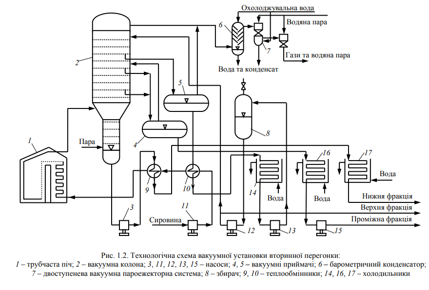
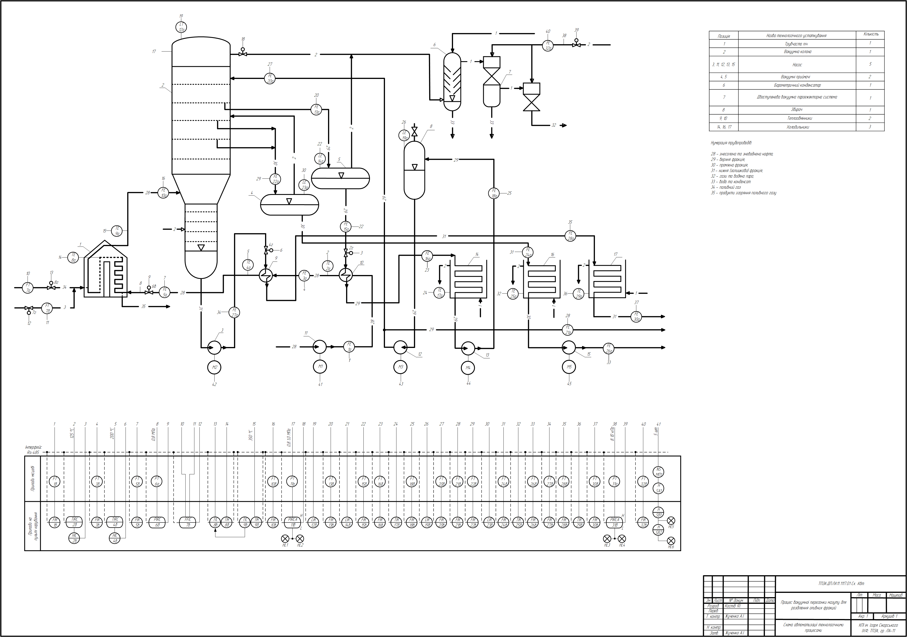
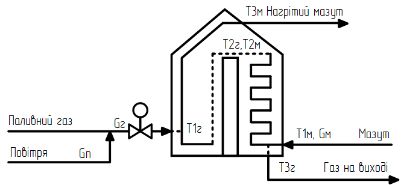
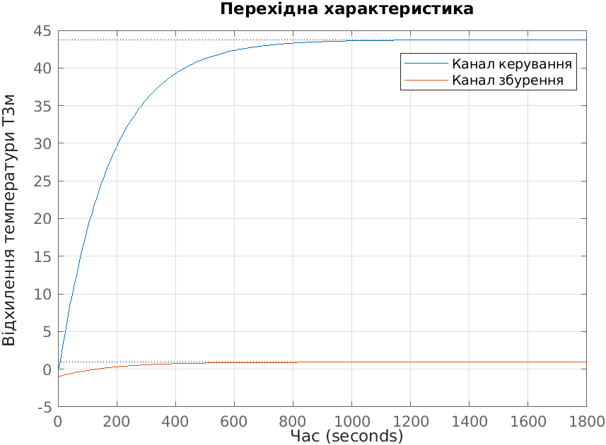
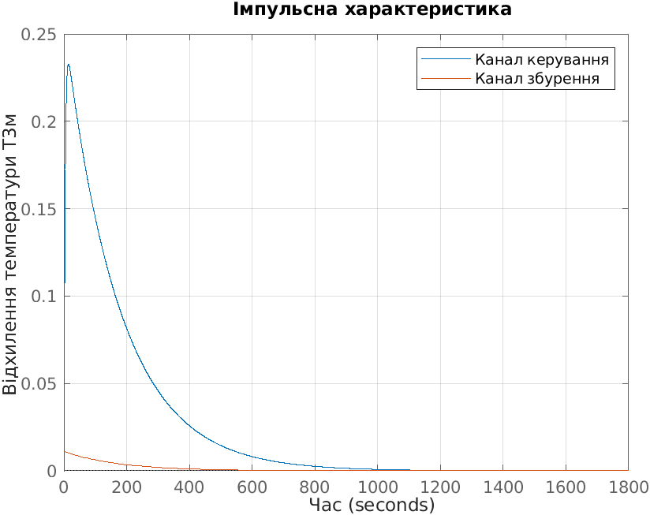
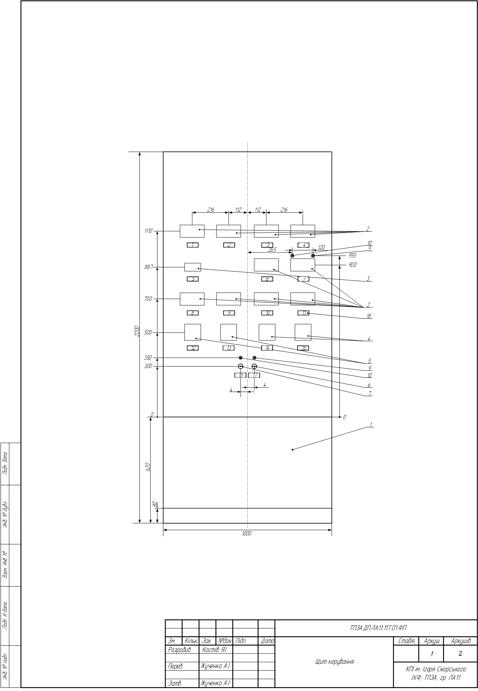
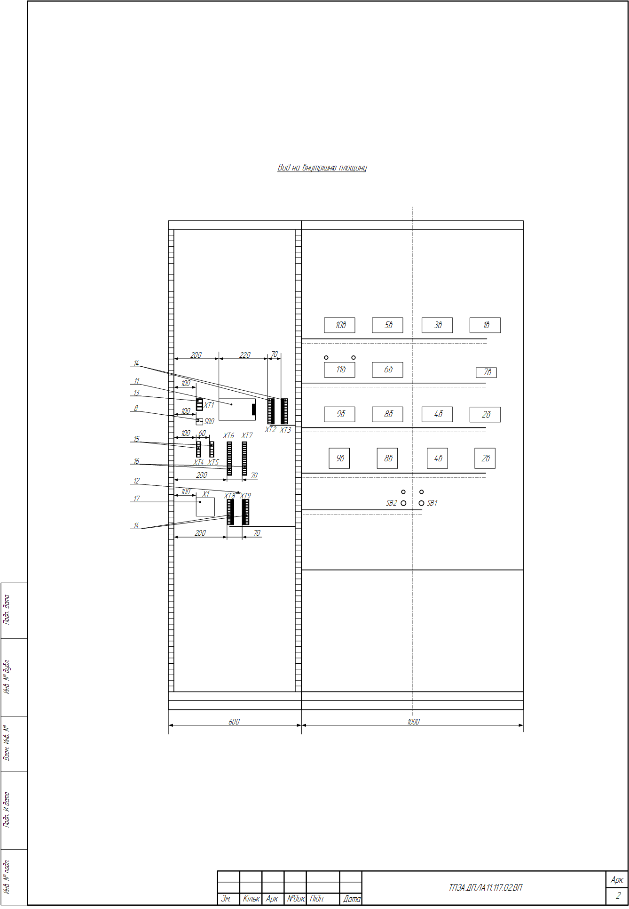

## Quick Navigation 

- 🇬🇧 [English version](#automation-of-vacuum-distillation-of-fuel-oil-for-lubricating-fraction-separation)
- 🇺🇦 [Українська версія](#українська-версія)

# Automation of Vacuum Distillation of Fuel Oil for Lubricating Fraction Separation

Bachelor thesis project (KPI, 2025)

This project presents the development of an automation system for the vacuum distillation process of fuel oil.  
The goal of the work is to increase the efficiency and stability of the oil refining process through the implementation of modern control methods and mathematical modeling.

---

# Relevance and Objective

Vacuum distillation of fuel oil is one of the key stages of primary oil refining.  
This process allows the separation of heavy oil fractions and the production of valuable lubricating components.

Automation of such technological processes improves:

- production efficiency
- process stability
- product quality
- operational safety

The objective of this work is to develop an automation system for the vacuum distillation process of fuel oil used for separating lubricating fractions.

---

# Technological Process Scheme

The technological scheme of the vacuum distillation unit includes:

- tubular furnace
- heat exchangers
- vacuum column
- receivers and collectors
- measurement and control systems

The process ensures the heating of fuel oil to the required temperature followed by fraction separation under vacuum conditions.

---

# Functional Automation Scheme (FSA)

A functional automation scheme was developed for the process control system.  
It includes sensors, transmitters, control devices and signal transmission lines required for monitoring and regulation of technological parameters.

---

# Technological Measurements

Measurement of technological parameters is essential for stable process control.

The mass flow rate of fuel oil is measured using a **Coriolis flowmeter OPTIMASS 6400**.

The measuring channel includes:

- KV — Coriolis flowmeter  
- PS — signal converter  
- LZ — communication lines  
- RVP — secondary recording device

Measured parameters:

- mass flow rate
- volumetric flow rate
- density

The calculated total measurement error of the channel is:

0.176 %

The system provides **accuracy class 1 with probability 0.95**.

---

# Tubular Furnace

The tubular furnace is a key element of the technological process.

It contains two main zones:

- convective zone
- radiant zone

The furnace provides the necessary heating of fuel oil before entering the vacuum column.  
Without proper temperature control the fractionation process becomes ineffective.

---

# Mathematical Modeling

To analyze the process, a mathematical model of the tubular furnace was developed.

The main system variables are:

- **Gg** — fuel gas flow rate (control action)  
- **T1m** — fuel oil temperature at furnace inlet (disturbance)  
- **T3m** — fuel oil temperature at furnace outlet (controlled variable)  
- **T1g** — fuel gas temperature at furnace inlet  
- **T3g** — flue gas temperature at furnace outlet  

A simplified analytical model was developed and solved using **MATLAB**.

Nonlinear equations were solved using the **fsolve** method.

---

# Dynamic Characteristics

Dynamic characteristics of the system were obtained for two channels:

Control channel:

Gg(p) → T3m(p)

Disturbance channel:

T1m(p) → T3m(p)

Step and impulse responses were analyzed to determine the dynamic properties of the system.

---

# Control System Synthesis

A control system was developed using **Model Predictive Control (MPC)**.

Simulation of the control system was performed in **MATLAB Simulink**.

Results show that the MPC controller provides:

- lower overshoot
- faster settling time
- improved system stability

---

# Control Panel Design

A control panel was designed for the automation system.

The project includes:

- front view of the control panel
- internal layout of components
- wiring diagrams

---

# Occupational Safety

Occupational safety measures were considered during the design process.

The working environment includes:

- ventilation and air conditioning systems
- noise reduction from 100 dBA to 60 dBA
- lightning protection
- fire alarm systems
- fire extinguishers
- electrical grounding and protection

Sanitary conditions were maintained:

- temperature: 22–24 °C
- humidity: 40–60 %

Personal protective equipment is also provided for operators.

---

# Conclusion

The following results were achieved in this work:

- analysis of the automation scheme
- automation of the tubular furnace
- development of a mathematical model of the process
- synthesis of an MPC control system
- design of a control panel
- implementation of occupational safety measures

The project demonstrates the full cycle of automation development — from process analysis to control system implementation.

---

# Technologies Used

- MATLAB
- Simulink
- Control Theory
- Process Automation
- Industrial Instrumentation

[⬆ Back to top](#quick-navigation)
---
# Українська версія

## Актуальність і мета

Вакуумна перегонка мазуту є одним із важливих етапів первинної переробки нафти.  
Даний процес дозволяє отримувати важкі нафтові фракції, зокрема оливні, які використовуються в різних галузях промисловості.

Автоматизація технологічних процесів переробки нафти дозволяє:

- підвищити ефективність виробництва
- забезпечити стабільність технологічних режимів
- покращити якість продукції
- підвищити безпеку експлуатації обладнання

Метою роботи є розробка системи автоматизації технологічного процесу вакуумної перегонки мазуту для розділення оливних фракцій.

---

## Технологічна схема

Технологічна схема установки вакуумної перегонки мазуту включає:

- трубчасту піч
- теплообмінники
- вакуумну колону
- приймачі та збирачі продуктів
- систему вимірювання та керування параметрами процесу

Основним завданням системи є забезпечення необхідного температурного режиму та стабільної роботи технологічного обладнання.

---

## Функціональна схема автоматизації

Для контролю та регулювання параметрів технологічного процесу була розроблена функціональна схема автоматизації.

Система включає:

- первинні вимірювальні перетворювачі
- вторинні прилади
- регулятори
- лінії передачі сигналів

Функціональна схема забезпечує контроль основних параметрів технологічного процесу.

---

## Питання технологічних вимірювань

Для вимірювання витрати технологічних середовищ використано **коріолісів витратомір OPTIMASS 6400**.

Він дозволяє одночасно визначати:

- масову витрату
- об'ємну витрату
- густину середовища

Структура вимірювального каналу:

- КВ — коріолісів витратомір
- ПС — перетворювач сигналів
- ЛЗ — лінії зв'язку
- РВП — вторинний реєструючий прилад

Сумарна похибка вимірювального каналу становить:

**0,176 %**

Це забезпечує **клас точності 1 з імовірністю 0,95**.

---

## Трубчаста піч

Трубчаста піч є основним елементом технологічного процесу.

Вона має дві основні зони:

- конвективну
- радіаційну

Піч забезпечує нагрів мазуту до необхідної температури перед подачею у вакуумну колону.  
Підтримання температурного режиму є необхідною умовою ефективного розділення фракцій.

---

## Математичне моделювання

Для дослідження процесу була розроблена математична модель трубчастої печі.

Основними параметрами системи є:

- **Gг** — витрата паливного газу (керуюча дія)
- **T1м** — температура мазуту на вході в піч (збурення)
- **T3м** — температура мазуту на виході з печі (регульована змінна)
- **T1г** — температура паливних газів на вході
- **T3г** — температура димових газів на виході

Було розроблено спрощену аналітичну модель процесу.

Розв’язання нелінійної системи рівнянь виконано в середовищі **MATLAB** за допомогою функції **fsolve**.

---

## Динамічні характеристики

Досліджено динамічні властивості об’єкта керування.

Отримано перехідні характеристики за каналами:

керування:

Gг(p) → T3м(p)

збурення:

T1м(p) → T3м(p)

Аналіз перехідних та імпульсних характеристик дозволяє оцінити інерційність системи та її реакцію на зміну параметрів.

---

## Синтез системи керування

Для керування температурним режимом трубчастої печі було синтезовано систему автоматичного керування.

Моделювання виконано в середовищі **MATLAB Simulink**.

Було застосовано **MPC-регулятор (Model Predictive Control)**.

Результати моделювання показали:

- зменшення перерегулювання
- швидший вихід на сталий режим
- підвищення стабільності роботи системи

---

## Щит керування

Було розроблено конструкцію щита керування для системи автоматизації.

Проєкт містить:

- креслення виду спереду
- розміщення обладнання на внутрішніх площинах
- схему монтажу та підключення приладів

---

## Охорона праці

У роботі розглянуто питання безпечної експлуатації обладнання.

Передбачено:

- систему вентиляції та кондиціювання
- блискавкозахист
- пожежну сигналізацію
- заземлення та захист від ураження електричним струмом
- застосування засобів індивідуального захисту

Для зменшення шуму застосовано звукоізоляційні матеріали, що дозволило знизити рівень шуму з **100 дБА до 60 дБА**.

Санітарні умови приміщення:

- температура: 22–24 °C
- відносна вологість: 40–60 %

---

## Висновок

У результаті виконаної роботи:

- проаналізовано технологічну схему процесу
- розроблено функціональну схему автоматизації
- створено математичну модель трубчастої печі
- досліджено динамічні характеристики системи
- синтезовано систему керування з MPC-регулятором
- спроєктовано щит керування
- розглянуто питання охорони праці

Таким чином реалізовано повний цикл проєктування системи автоматизації — від аналізу технологічного процесу до розробки системи керування.

[⬆ Back to top](#quick-navigation)
